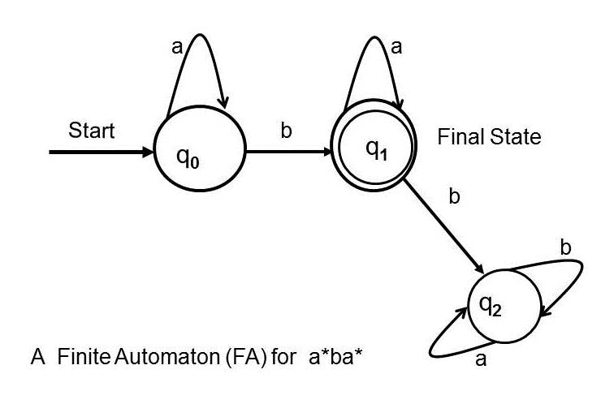

# What is the Finite Automata?
It's an another method for defining languages.
It's graphical method for represting the language.
Finite automata is also called finite automata machine (FAM)  

**Definition**  
The finite state machine is designed for accepting and rejecting the different strings of the languages from the machine.  
It consists of a finite number of states and operates on input symbols to transition between these states based on a set of rules.

All regular languages can be represented by finite automata

## Finite Automata Contains Six Stages 
**1) Start State (Q):** Represnting the start of machine.  
**2) Final State (Qo):** Represnting the successful end.   
**3) Transition/ Movement (→):** Represnting the reading of the alphabets from the finite state machine     
**4) Strings/letters in alphabets (Σ):** Strings are characters or a set of characters that can be accepted or rejected by finite state machines.   
**5) Number of States:** States comes in b/w start and final state.  

    

It takes the string of symbol as input and changes its state accordingly, when the desired symbol is found then the transition occurs.    
At the time of transition the automata can either move to the next state or stay in the same state.    

## Why it named as finite automata?
**Automata:** Plural of automaton (i.e Automatic or self controlled machines).   
**Finite:** Finite number of states/ letters/ transitions.  
 
   

# Types of Finite Automata  
Finite Automata without output:
- Deterministic Finite Automata (DFA)
- Non-Deterministic Finite Automata (NFA or NDFA)

Finite Automata with Output:
- Moore Machine
- Mealy Machine  

## 1) Deterministic Finite Automata (DFA)
Deterministic refers to the uniqueness of the computation. In the DFA, the machine goes to one state only for a particular input character. DFA doesn't accept the null move, meaning every state must have a transition defined for every input symbol.

### Why we named it Deterministic finite automata?
**Deterministic :** Output is already known (for only one next step)

> **Example :**  L1 = Set of all strings that start with '0'.  
   L1 = {0, 00, 01, 000, 010, 011, ....}  

      

  **Transition Table**    
  | State/symbol | 0 | 1 |  
  |--------------|---|---|
  |q0 | q1 | q2 |
  |q1 | q1 | q1 |  
  |q2 | q2 | q2 |   

    

## States 
### Initial State: 
It is the state that the machine naturally starts in before it reads any input. it is called as `Entry Point.`  
**Represented by**  
               

### Final State:   
It is the state where the machine halts when it has no input left. it is also called `Accepting State`.  
**Represented by**  
   

### Dead State / Dead End State  
It is also called as `Rejecting State` and  `Trap State.` Once the machine enters a dead state, there is no way for it to reach an accepting state.  

### Jump Back  
A state to which the DFA transitions backward or returns when it encounters an unexpected or mismatched input symbol.  

### Examples of DFA
#### 1) EVEN-EVEN  (DFA & RE Even Even Language)
Even number of a's and Even number of b's.    
Σ = {a,b}     

RE = [aa + bb + (ab+ba)(aa+bb)* (ab+ba)]*  

#### 2) Draw the FA that accept exactly a 
RE = a    

#### 3) Draw FA that accepts all words starting with a  

RE = a(a+b)*     

#### 4) Draw FA that accepts exactly a or b 
 RE = a+b      

   

#### 5) Draw FA for th language that have b as a second letter over  = {a,b}  

RE = (a+b)b(a+b)*   

   

   

## 2) Non-Deterministic Finite Automata (NFA)  
NFA similar to DFA but add other features:  
- It can transition to multiple states for same input.
- It allows null moves, where the machine can change states without consuming any input.  
- Dead state not required in NFA.

> **Example :**  Construct the NFA that accepts strings ending in 'a'.  
**Given :**  Σ = {a,b}  
          Q = {q0, q1}  
          F = { q1}   

**Transition Table**   
|State /Symbol | a | b | 
|--------------|---|---|  
|q0 | {q0, q1} | q0 |  
|q1 | ε | ε |  

   

- Although NFA appear more flexible, they do not have more computational power than DFA. 
- Any NFA can be converted to an equivalent DFA although the resulting DFA may have more states. 
- Both DFA and NFA recognize the same set of regular languages.  

### Examples of NFA  
#### 1) The language ends with 00 and Σ = {0, 1}  
RE = (1+0)*00    

    

#### 2) Accept all words that contains substring aa over Σ = {a, b}  
RE = (a+b)* aa(a+b)*    

   

# Applications of Finite Automata 
### 1) Lexical Analysis in Compilers:  
Finite automata are used in the lexical analysis phase of compilers to recognize tokens (e.g: Keyword, identifiers, operators) in the source code.  
**Example :** The DFA would accept strings like `var1` but reject `1var`.  

### 2) Text Processing and Search:  
Finite automata are used in text editors and search engines to find patterns to find patterns within text.   

### 3) Network Protocol:   
Finite automata model the behavior of network protocols, ensuring correct data transmission and error handling.  

### 4) Natural Language Processing (NLP):  
Finite automata are used in NLP tasks such as, A DFA can be used to recognize valid words forms in a language.   
For instance, it can accept plural forms of nouns by recognizing patterns like adding `s` or `es` to the singular form.  

### 5) Robotics:  
Finite automata are used in robotics for task automation and decision-making processes.  