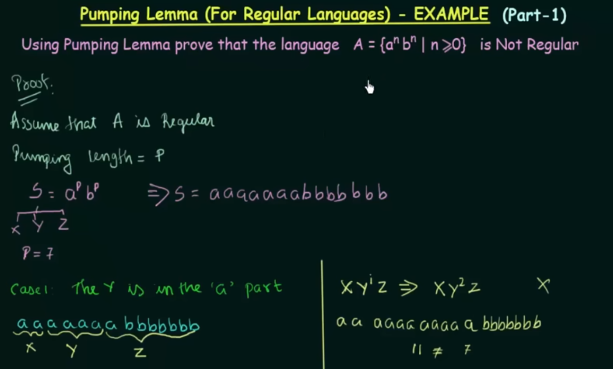
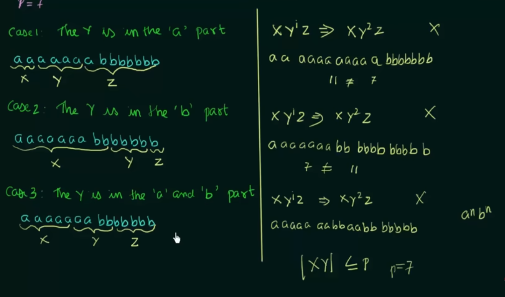

# Pumping Lemma  

Pumping Lemma is used to prove that a language is `Not Regular`  

Pumping lemma is the negitive: 
- if language doesn't satisfy all conditions of pumping lemma test then it is not a regular language.
- If language satisfy all conditions of pumping lemma test then it is undescriable that it is regular or not regular. 
that's why we always try to fail to pumping lemma test.  

If L is an infinite language then there exists some positive integers `'n'(pumping length)` such that any string `w ε L` has length greater than equal to 'n' i.e `|W|>= n` then w can be divivded into three parts, `w = xyz` , then satisfy following conditions. 
 
1) for each i>= 0, xy^iz ε L 
2) |y| > 0, and 
3) |xy| <= n   

### Examples  
   
   

Language A ε regular language
