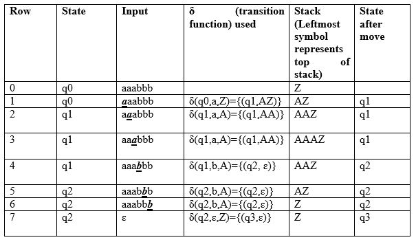

# Pushdown Automata  
A pushdown Automata (PDA) is a way to implement a context Free Grammer in a similar way we design Finite Automata for Regular Grammer.    

- It is more powerful than FSM  
- FSM has a very limited memory but PDA has more memory. 
- PDA = Finite State Machine + A Stack     

## Formal Defination of PDA  
A Pushdown Automata is formally defined by 7 Tuples as shown below:
 P = (Q, ∑, Γ, δ, q0, Z, F)  

- Q is the set of states
- ∑ is the set of input symbols
- Γ is the set of pushdown symbols (which can be pushed and popped from the stack)
- q0 is the initial state
- Z0 is the initial pushdown symbol (which is initially present in the stack)
- F is the set of final states
- δ is transition function  

**Transition Function (δ)**  
δ takes as argument a triple δ (q,a,X) where: 
1) q is a state in Q  
2) a is either an input symbol in ∑ or a = ε  
3) X is a stack symbol, that is a member of Γ  

The ouput of δ is finite set of pairs (P, Y) where: 
- p is new state. 
- Y is a stack symbols that replaces X at the top of the stack

## A Pushdown Automata has three Components:  
**1) Input Tape:**   
This component holds the input string that the PDA processes, similar to a tape in a finite automaton.    

**2) Control Unit:**  
The control unit manages the state transitions based on the current state, the input symbol being read from the tape, and the symbol on top of the stack. It can also perform push or pop operations on the stack.    

**3) Stack:**   
The stack is a key component of the PDA. It's a data structure where symbols can be added (pushed) to the top or removed (popped) from the top. The stack is used to store information that is relevant to the state transitions and the acceptance of the input.   

   

A PDA can accept or reject an input string based on whether it can reach an accepting state after processing the entire input string. The PDA can also accept by empty stack, which means that the stack is empty after processing the input string. 

## Examples
### 1) Define the pushdown automata for language {a^nb^n | n > 0} 
**Solution:** M = where Q = { q0, q1 } and Σ = { a, b } and Γ = { A, Z } and δ is given by : 

**Transition ID**  
δ( q0, a, Z ) = { ( q0, AZ ) }    
δ( q0, a, A) = { ( q0, AA ) }   
δ( q0, b, A) = { ( q1, ∈) }   
δ( q1, b, A) = { ( q1, ∈) }   
δ( q1, ∈, Z) = { ( q1, ∈) }    

Let us see how this automaton works for aaabbb:   

 

### 2) Construct a PDA that accepts the language L = {w ∈ {0,1}* | w has equal number of 0's and 1's}     
#### **PDA Construction**  
**States**

q₀: Initial state
q₁: Processing state (counting differences)
q₂: Final/Accept state

**Stack Alphabet**

Γ = {0, 1, Z₀}

- Z₀: Bottom stack marker
- 0, 1: Used to track the difference between counts

**Input Alphabet**

Σ = {0, 1}

**Transition Function δ**  
|Current State|	Input|	Stack Top|	Next State|	Stack Operation|
|-------------|------|-----------|------------|----------------|
|q₀	|ε	|Z₀	|q₂	|Z₀ |(empty string accepted)
|q₀	|0	|Z₀	|q₁	|0Z₀ |(push 0)
|q₀	|1	|Z₀	|q₁	|1Z₀ |(push 1)
|q₁	|0	|0	|q₁	|00 |(push another 0)
|q₁	|0	|1	|q₁	|ε |(pop 1, cancel with 0)
|q₁	|1	|0	|q₁	|ε |(pop 0, cancel with 1)
|q₁	|1	|1	|q₁	|11 |(push another 1)
|q₁	|ε	|Z₀	|q₂	|Z₀ |(accept if stack is empty)|     

**How It Works**   
The PDA uses the stack to keep track of the "excess" of 0's or 1's:
- When reading a 0: if there's a 1 on top of stack, pop it (they cancel out); otherwise push 0
- When reading a 1: if there's a 0 on top of stack, pop it (they cancel out); otherwise push 1
- Accept only when the entire input is consumed and only Z₀ remains on the stack        

