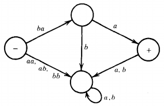

# What is the Transition Graph?  
In the Theory of Automata, a Transition Graph (TG) is a way to represent how an automaton (machine) moves from one state to another by reading input symbols.

- It is a graphical form of a Non-deterministic Finite Automaton (NFA).  
- Can have ε-transitions (move without reading any symbol)
- Can have multiple transitions from a state for the same input (non-deterministic)   

**formal definition**  
A Transition Graph is a general form of NFA and is defined as:  

> TG = (Q, Σ, I, F, δ)

**Where:**

- Q = Finite set of states
- Σ = Input alphabet
- I = at least one initial state (i.e: more than one start state)
- F = Set of final states
- δ = Transition function (Q × (Σ ∪ {ε}) → P(Q)) — means transitions can go to many states, including with ε   

## Graph  

## Transition Graph examples        
[Transition Graph examples](assets/Transition_graph.pdf)

   

# Difference between Finite Automata and Trasition Graph  
| Feature            | Finite Automaton (DFA/NFA)       | Transition Graph (TG)                  |
| ------------------ | -------------------------------- | -------------------------------------- |
| Initial State      | Only **one** initial state       | Can have **a set** of initial states   |
| Transition Symbols | Only symbols from input alphabet | Can also include **ε (epsilon)** moves |
| Purpose            | Formal computation model         | Generalized **graphical structure**    |
| Used For           | Implementation, simulation       | **Conversion**, **theory**, and proofs |  

## Generalization of Finite Automata
Every finite automaton can be represented as a TG, but not every TG can be represented as a finite automaton. 
